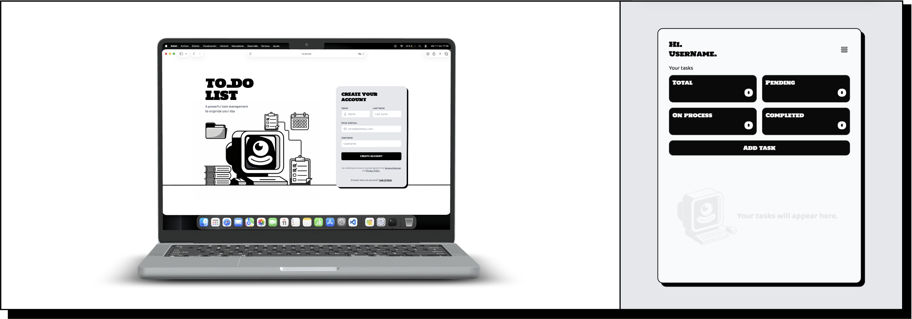

# To.Do List!


## General Info
**To.Do List** is a project developed to put into practice the fundamental concepts learned during *Sprint 1* and *Sprint 2*, using the MVC (Model–View–Controller) architectural pattern.
The development is based on an existing codebase originally created by another developer.

The application simulates a user registration system, allowing each user to manage their daily tasks.

## Technologies Used

* PHP 8.0
* Tailwind CSS
* JSON
* MySQL

## Features

1. Create account (session simulation)
2. Create, edit, delete daily tasks
3. Mark tasks as in progress and completed
4. Keep track of the number of tasks
5. From your profile, edit your information.
6. Have you already registered?
    1. Go to your tasks
    2. Delete users



## Setup

* Clone the repository
```
https://github.com/miguelm-montano/Tasca_S3.03_ToDoApp.git

```
* Create a database called for example *todolist* in XAMPP, MAMP, etc.

* Import the database located in the config folder.

* Create the configuration file from the template:

```bash
   cp database/config.example.php database/config.php
```

* Edit `database/config.php` with your credentials:

```
   <?php
   return [
       'host' => 'localhost',
       'dbname' => 'todolist',        // Name of your database
       'username' => 'root',          // UMySQL user
       'password' => ''               // Password (empty in XAMPP, ‘root’ in MAMP)
   ];
```

From your browser go to:
```
http://localhost/todolist-app/web/
```

## Project Status

The project currently works with both JSON-based storage and a MySQL database. All core functionalities are fully implemented and the application meets the basic project requirements.

## Future Features

Some features that could be implemented in future versions of the project include:
* Adding password-based authentication for each user account.
* Complete validations where required.
* Improving task listing behavior so that completed tasks are automatically moved to the end of the list.
* Allowing users to upload a profile picture for their account.
* Implement task groups by type.
