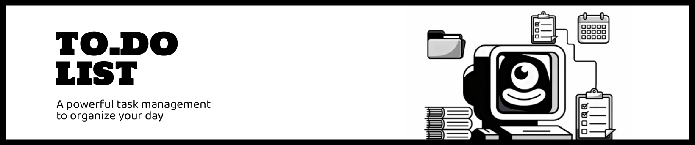

# To.Do List!



## General Info
**To.Do List** is a project developed to put into practice the fundamental concepts learned during *Sprint 1* and *Sprint 2*, using the MVC (Model–View–Controller) architectural pattern.
The development is based on an existing codebase originally created by another developer.

For this reason, a significant amount of time was dedicated to understanding how the application is structured and why it works in its current way before implementing new features and improvements.

The application simulates a user registration system, allowing each user to manage their daily tasks.

## Technologies Used

* PHP
* Tailwind
* .JSON
* MySQL

## Features

1. Create account
2. Create daily tasks
3. Mark tasks in progress
4. Mark completed tasks
5. Delete Tasks
6. Edit tasks
3. Dashboar
    1. Redirect to previous user
    2. Delete users

## Setup

Clone the repository
```
https://github.com/miguelm-montano/Tasca_S3.03_ToDoApp.git
```

From the terminal in develop branch:
```
php -S localhost:8000 -t web 
```

From your browser:
```
http://localhost:8000
```

## Project Status

The project currently works with both JSON-based storage and a MySQL database. All core functionalities are fully implemented and the application meets the basic project requirements.

**Currently, input fields do not have validation implemented.**

## Future Features

Some features that could be implemented in future versions of the project include:
* Adding password-based authentication for each user account.
* Complete validations where required.
* Improving task listing behavior so that completed tasks are automatically moved to the end of the list.
* Allowing users to upload a profile picture for their account.
* Implement task groups by type.
